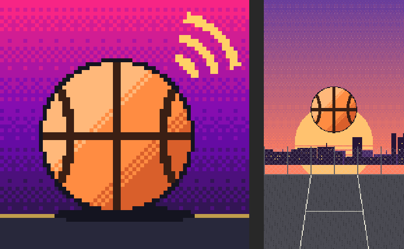

# Retro Hoops

*Call your shot. Build your legacy.*

An original, offline, portrait-first retro arcade basketball game for iPhone, built in Unity. It plays 3v3 on a half court with touch controls, a skill-based shot meter, real defense, play calling, and a season-and-progression loop. All teams, players, courts, logos, art, and audio are original to this project and generated in code.

> **Status: Phases 1–26 implemented.** The engine-free game logic compiles on .NET and passes 536 automated tests. The Phase 25 code compiled in Unity 6000.6.3f1 and archived in Xcode (App Store build 2, October 2026); the TestFlight upload of that build has not gone through yet. The last on-device run was the Phase 18 build. Phase 26 (two-phone play, Couch Cup, Summer Story, commentary, frame pacing) has passed the logic tests and a C# compile check against Unity's assemblies here, but has not been compiled in Unity, built for iOS, or played on a device. See [Known limitations](#known-limitations).



## Requirements

| | |
|---|---|
| Unity | **Unity 6 LTS** (6000.0 or newer 6.x LTS) with the **iOS Build Support** module |
| Packages | Declared in `Packages/manifest.json`: URP 17, Input System 1.11, uGUI 2.0 (includes TextMeshPro), Test Framework 1.4, 2D Sprite. Unity may upgrade these to match your editor. |
| iOS builds | macOS, current Xcode, and an Apple Developer account for device builds |

## First-time setup

1. In **Unity Hub**, choose **Add ▸ Add project from disk**, select this `CallerRetroBall` folder, and open it with Unity 6 LTS.
2. If the Input System asks to enable the new input backend, choose **Yes**. The editor restarts.
3. On first open the editor runs **RetroBall ▸ Run Project Setup** automatically (you can rerun it from the menu). It:
   - creates the six scenes in `Assets/Scenes` and adds them to Build Settings, Boot first;
   - imports TextMeshPro Essential Resources;
   - applies portrait-only, iOS 15+ Player Settings;
   - writes default league content to editable ScriptableObjects in `Assets/Resources/Data/…`;
   - validates the content and logs a report.
4. **URP 2D (manual, about a minute):** **Assets ▸ Create ▸ Rendering ▸ URP Asset (with 2D Renderer)**, save it to `Assets/Settings`, then assign it in **Project Settings ▸ Graphics** and **▸ Quality**. The game also runs on the built-in pipeline.
5. Open `Assets/Scenes/BootScene.unity` and press **Play**. For a phone-shaped preview, set the Game view to an iPhone portrait resolution such as 1179×2556.

**Menu commands** (RetroBall menu): Run Project Setup (safe to rerun), Rebuild Scenes (overwrite), Regenerate Content Assets (overwrite), Validate Content.

## Modes

- **PLAY** opens every way to start a game:
  - **Quick Call:** pick one of your two unlocked teams, cycle the opponent, choose difficulty, tip off. Pays half rewards.
  - **Daily Challenge:** one seeded challenge per day, the same for everyone and offline (e.g. "Win by 6", "Hit 3 GREEN releases"). Completing it pays 75 SP plus 15 per consecutive day (capped).
  - **2 Player:** local head to head, each person leading a 3-player side. P1 uses touch or WASD/K/J/L/C; P2 uses arrows + Num1 shoot / Num2 pass / Num3 steal / Num0 pick & roll, or game controllers. No rewards.
  - **Two Phones** (2 Player ▸ TWO PHONES): each player on their own iPhone or iPad nearby, over Wi-Fi or Bluetooth, no internet or account (Apple's Multipeer Connectivity). One hosts and picks both teams; the other joins. Both phones run the same simulation in lockstep and only controller input is sent.
  - **Couch Cup** (2 Player ▸ COUCH CUP): a knockout for 2 to 8 named players on one device, with byes, replayed ties, and a saved bracket.
  - **How to Play:** a guided tutorial (move, shoot, green, pass, ask, call, steal, jump), offered on first launch and from Settings; +100 SP the first time.
- **Summer Story:** eight chapters from a 1-on-1 at the overpass to the Sunburst League final (Full Court), with scenes before and after each game and a goal per chapter (win by 4, three assists, three steals, break someone's ankles). Original cast: Nova Quinn, Big Sal, Mic Tally and Kojo Stride of the Velvet Hour. Mic Tally also calls big moments as text commentary in every mode (Settings ▸ COMMENTARY).
- **Rise Mode:** play as the First Callers, recruit players from teams you beat (YOUR CREW), take on rival crew Neon Static once a season, with story scenes along the way. Beat five street crews in The Blacktop Circuit, join The Caller League for a 10-game season (event cards between games, energy and chemistry), then a four-team bracket for The Gold Signal Cup. Next season starts from the hub.
- **First Call Classic:** a four-team knockout. Your First Callers (fourth seed) face three league teams drawn at random; win the semi and the final for the title (+200 SP bonus). Enter a new Classic any time it's over.
- **Practice Lab:** Free Shoot (60 s), Passing Targets (45 s), Dribble Lane (5 cones, timed). Personal bests are saved. No rewards.
- **Locker Room:** nickname, CREATE your own player (look, number, style of play), STATS (records, season history, recent games), trained ratings, upgrades (Signal Points + a game played between purchases), cosmetics shop and equip, career stats and practice bests.
- **Settings:** How to Play, accessibility (left-handed, large buttons, tap to shoot, reduce motion), optional Game Center sign-in (see [`docs/GAME_CENTER.md`](docs/GAME_CENTER.md)), music and SFX volume, haptics, screen shake, UI scale, colourblind team patterns, difficulty, reset save (with confirmation), credits and licences.

## Controls

| Action | Touch | Keyboard / gamepad (Editor, controllers) |
|---|---|---|
| Move | Floating thumbstick anywhere in the lower-left area | WASD / arrows / left stick |
| Shoot: hold to fill the meter, release in the green | SHOOT | K (hold) / A |
| Pass (aim with the stick); ASK when a teammate has the ball | PASS / ASK | J / X |
| Call a play: Pick & Roll, Give & Go, Clear Out | CALL (offense, your team has the ball) | C / Y |
| Steal | STEAL (on defense) | L / B |
| Jump to contest or block | JUMP (the SHOOT button on defense) | K / A |
| Switch onto the ball handler | SWITCH (the PASS button on defense) | J / X |
| Pause | II (top-left) | Esc |
| Debug: knock the ball loose | — | B key (Editor and development builds only) |

After a steal or defensive rebound, SHOOT reads CLEAR until you take the ball back beyond the arc. Leaving or switching away from the app pauses the match.

## Running tests

**In Unity:** **Window ▸ General ▸ Test Runner**.
- **EditMode:** all logic tests plus project-structure checks.
- **PlayMode:** boot flow, scene transitions, match start-up, every menu scene building without errors, and a practice drill start.

**Without Unity (logic only):**

```bash
cd ../tools/LogicTests
dotnet run --project Runner/Runner.csproj
```

This compiles `Assets/Scripts/Logic` as .NET Standard 2.1 / C# 9 (Unity's API level) with warnings as errors, then runs every test in `Assets/Tests/EditMode/Logic` through a small NUnit-compatible shim. Current result: **278 passed, 0 failed**.

`tools/SyntaxCheck` parses every C# file under `Assets/`. It does not resolve Unity APIs, so it is not a substitute for compiling in Unity.

## iOS build

Full steps, from the first build to App Store submission, are in [`docs/RELEASE_CHECKLIST.md`](docs/RELEASE_CHECKLIST.md). Store metadata, the privacy label, and the age-rating answers are in [`docs/APP_STORE.md`](docs/APP_STORE.md).

The short version:

1. **Player Settings:** replace the placeholder bundle ID `com.retroball.game` with your own, and set your Team ID.
2. Run **RetroBall ▸ Release ▸ Generate App Icon and Launch Image**, then **Apply Release Player Settings**.
3. Run **RetroBall ▸ Release ▸ Build iOS (Simulator)** or **Build iOS (Device)**. From Terminal, close the Editor and run `tools/build_ios.sh [simulator|device]`. Either way the output goes to `iOSBuild/…`.
4. Open `iOSBuild/<Simulator|Device>/Unity-iPhone.xcodeproj`, choose your team under **Signing & Capabilities**, pick a simulator or your iPhone, and press **Run**.

The build post-processor writes the Info.plist keys (no non-exempt encryption, full screen, hidden status bar, Sports Games category). `Assets/Plugins/iOS/PrivacyInfo.xcprivacy` declares no tracking and no collected data.

## Project architecture

```
Assets/Scripts/
  Logic/         Engine-free C# (noEngineReferences), unit-tested inside and outside Unity:
    Definitions/ Content/     data model, default league content, validator
    Rules/ Math/ Court/       scoring, deterministic RNG, geometry
    Match/                    MatchSimulation (partial: core, defense & plays), AiBrain, shot/pass models, stats
    Progression/              rewards, career, season & playoffs, Rise Mode, practice drills
    Save/                     MiniJson + versioned SaveCodec
    PixelArt/ Audio/          procedural sprites, logos, courts, app icon, launch image, sounds, music
  Data/          ScriptableObject wrappers + ContentDatabase (falls back to built-in defaults)
  Core/          App hub, SceneFlow, SaveStore (atomic writes + backups), Haptics, Game Center interface
  UI/            Code-built uGUI/TMP kit, controls, menu screens (main, Rise hub, Locker Room, Settings)
  Gameplay/      Match controller, views, camera rig, HUD, post-game
  Input/         Floating joystick and hold/release action buttons
  Audio/         AudioManager (pooled voices, synthesised clips)
  Editor/        ProjectSetup, ReleaseTools (icon, launch image, iOS builds), IosPostProcess (Info.plist)
Assets/Plugins/iOS/   CallerHaptics.mm, CallerGameCenter.mm, PrivacyInfo.xcprivacy
Assets/Tests/         EditMode/Logic, EditMode/Unity, PlayMode
```

**Key decisions**

- **Logic is separate from the engine.** Rules, AI, and progression are deterministic, seeded, and testable anywhere. Gameplay never uses `UnityEngine.Random`.
- **All UI is built in code** from `UiKit`, so there are no fragile prefabs and one consistent look.
- **No hidden AI boosts.** Difficulty changes only reaction time, decision quality, shot selection, release accuracy, and error rate. The validator rejects anything else.
- **Rewards are applied once.** Every match has an id; `Career.ApplyMatch` ignores ids it has already seen, so a rematch, scene reload, or double tap can't grant twice.
- **Save is local and forgiving.** Versioned JSON in `persistentDataPath/career.json`, written via temp file + move. A corrupt file is backed up and replaced with a fresh career, and the player is told.
- **Game Center** sits behind `IGameCenterService`. Only a no-op implementation ships.

## Known limitations

- **Phase 26 is not compiled in Unity yet.** It passed a compile check against Unity's reference assemblies here; the new native plugin (`Plugins/iOS/RetroLink.mm`) passed only a syntax check against stand-in headers, not the real iOS SDK. Two-phone play needs two real devices to test; it can't run in the Editor.
- **Device testing is behind.** The last device run was the Phase 18 build. iPad and Mac layouts have not been checked on hardware.
- Not tuned by hand: balance numbers come from AI-vs-AI simulations (AI field-goal rate about 29 % Rookie, 38 % Caller, 56 % Legend), not from people playing.
- The URP asset must be assigned by hand (setup step 4).
- The app icon and launch image are generated, but not yet checked in Xcode or on a device. There is no localisation (English only).
- Game Center is implemented (opt-in), but its leaderboards and achievements must be created in App Store Connect and it hasn't been tested on a device.

## Asset and licence disclosure

- **Art:** every sprite, logo, court, and backdrop is generated procedurally from code in `Assets/Scripts/Logic/PixelArt`. No external images.
- **Audio:** every sound effect and the music loop are synthesised at runtime by `AudioSynth`. No recordings or samples.
- **Font:** Liberation Sans, TextMeshPro's default font, SIL Open Font License 1.1.
- **Code:** all original. The iOS haptics plugin is original and uses only Apple's public UIKit APIs.
- **Names:** every league, team, player, court, and event name is fictional and original. No real leagues, teams, players, brands, arenas, or likenesses.
- **Privacy:** no ads, analytics, tracking, accounts, or in-app purchases. Progress stays on the device. Optional Game Center (off by default) sends scores and achievements to Apple only.
